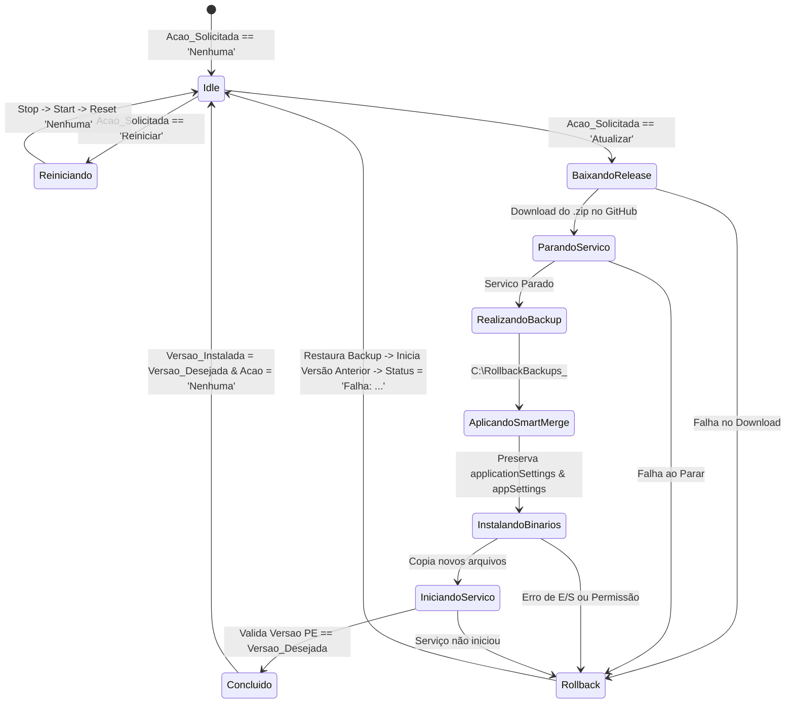

# SharePoint List Schema Specification (`Controle_Servicos`)

Este documento descreve a especificação técnica e o esquema da lista do SharePoint utilizada como barramento de estado para o **Windows Services Fleet Manager**.

## Nome da Lista
- **Nome no SharePoint**: `Controle_Servicos`

---

## Esquema das Colunas

| Nome de Exibição | Nome Interno | Tipo de Dado | Obrigatório | Valores / Opções Permitidos | Descrição |
| :--- | :--- | :--- | :--- | :--- | :--- |
| **Title** | `Title` | Linha Única de Texto | Sim | String (`Hostname_Nome_Servico`) | Chave primária única do registro. Ex: `SRV-CAP-01_DNA.ConfigMonitorSVC` |
| **Hostname** | `Hostname` | Linha Única de Texto | Sim | String | Nome da máquina servidora (ex: `SRV-CAPTURE-01`) |
| **Praça** | `Praça` / `Praca` | Linha Única de Texto | Não | String | Identificador do site/praça extraído da tag `<idHost>` do `configxml.xml` |
| **CS** | `CS` | Número Inteiro | Não | Integer | Código da estação extraído da tag `<CS>` do `configxml.xml` |
| **Nome do Serviço** | `Nome_Servico` | Linha Única de Texto | Sim | String | Nome exato do Serviço no Windows (ex: `DNA.ConfigMonitorSVC`) |
| **Versão Instalada** | `Versao_Instalada` | Linha Única de Texto | Não | String | Versão PE do executável lida no disco (ex: `1.0.0.15`) |
| **Versão Desejada** | `Versao_Desejada` | Linha Única de Texto | Não | String | Tag da release no GitHub para atualização (ex: `v2.4.1` ou `1.0.0.16`) |
| **Status do Serviço** | `Status_Servico` | Opção | Não | `Em Execução`, `Parado`, `Não Encontrado` | Estado real do serviço no sistema operacional |
| **Ação Solicitada** | `Acao_Solicitada` | Opção | Sim | `Nenhuma`, `Atualizar`, `Reiniciar` | Comando operacional disparado pelo operador |
| **Status da Atualização**| `Status_Atualizacao`| Linha Única de Texto | Não | `Aguardando`, `Baixando Release`, `Parando Serviço`, `Realizando Backup`, `Aplicando Smart Merge`, `Instalando Binários`, `Iniciando Serviço`, `Concluído`, `Falha: <motivo>` | Feedback em tempo real da máquina de estados do agente |
| **Última Atualização** | `Ultima_atualizacao`| Data e Hora | Não | Formato ISO 8601 Datetime | Timestamp da última resposta/heartbeat do Agente |
| **URL Comunicação** | `Url_Comunicacao` | Linha Única de Texto | Não | String | Valor da tag `<setting name="WCFMainURL">` do `.exe.config` |

---

## Mapeamento do Fluxo Operacional

